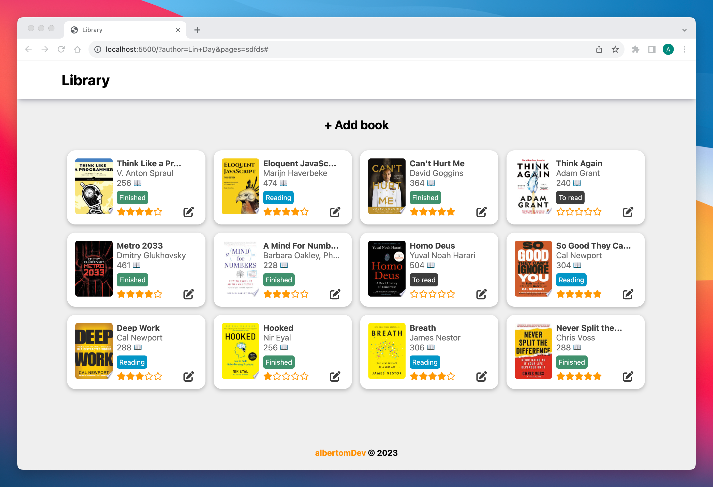
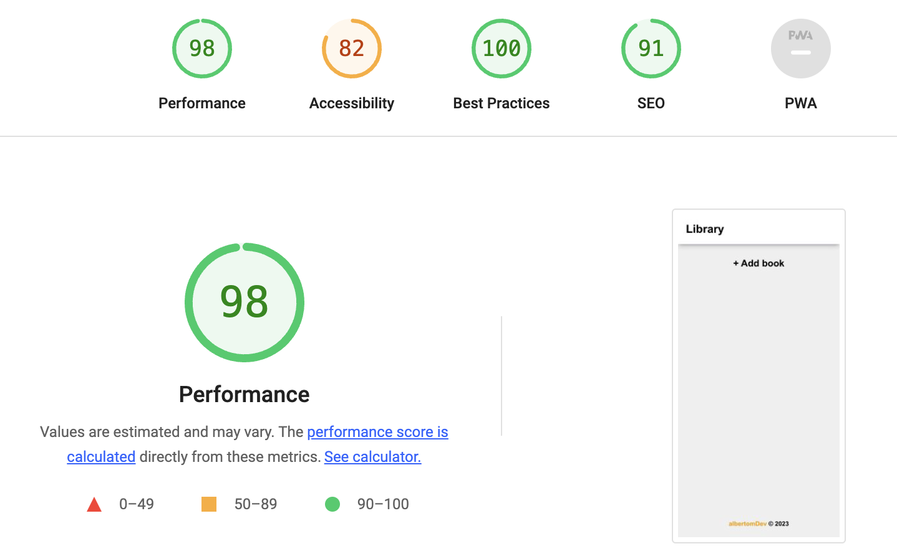

# Library

**Live demo:** https://albertomdev.github.io/library/

I am not a UI designer, so I like to take inspiration from other creators. Cloning projects from creators that are better than me, forces me think hard and google a lot. Once again, I took inspiration from michalosman but added my own salsa.

## Short description

It's a library webapp where you can search, rate and keep track of your of books. This uses the google books API.

This project is part of The Odin Project curriculum.

## Technologies used

- HTML
- CSS
- JavaScript

## Features

- API GET request
- Add, edit and delete book
- Known limitations
  - When rating the books, the stars need to be selected one by one
  - No persistent storage
  - No login feature

## Performance

I let [Google Lighthouse](https://chrome.google.com/webstore/detail/lighthouse/blipmdconlkpinefehnmjammfjpmpbjk?hl=en) run over my application to check for performance, accessibility, use of best practices and SEO optimization.

## What I learned:

- How promises work
- How to Get data from an API
- Reinforced my DOM manipulation knowledge

## Feedback

The known limitations is something I will implement later on with react.js because I like to listen and read books from multiple platforms, so having a centralised place will be nice.

Any Feedback to improve or expand the this library project is more than welcome.

## Credits

This page layout was inspired from: https://github.com/michalosman/library
